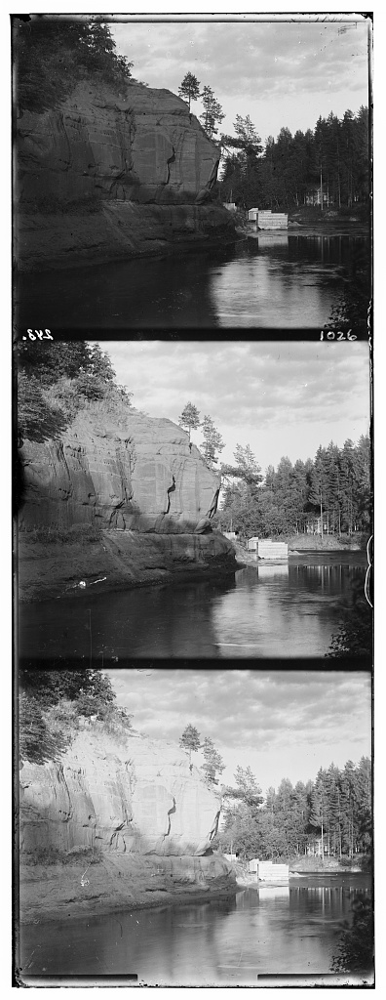
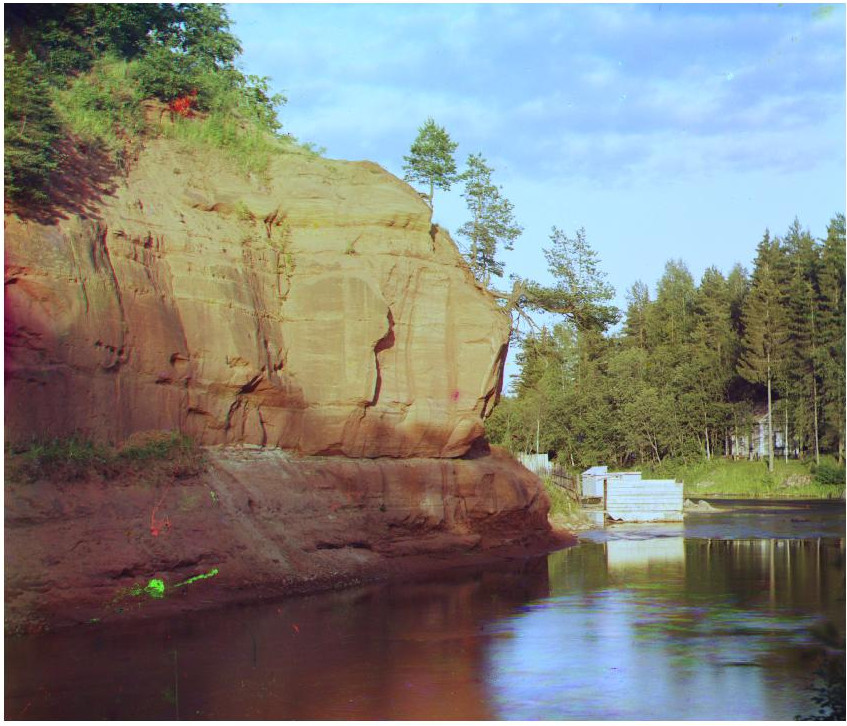

Prokudin-Gorskii
=======

This was an assignment in the course TNM087 at Linköpings University. The goal was to take an image containing three pictures, each representing a color channel. Match these and combine them, some extra work was done to also automatically crop the images and color correct them.

## Result

#### Original

#### Final

